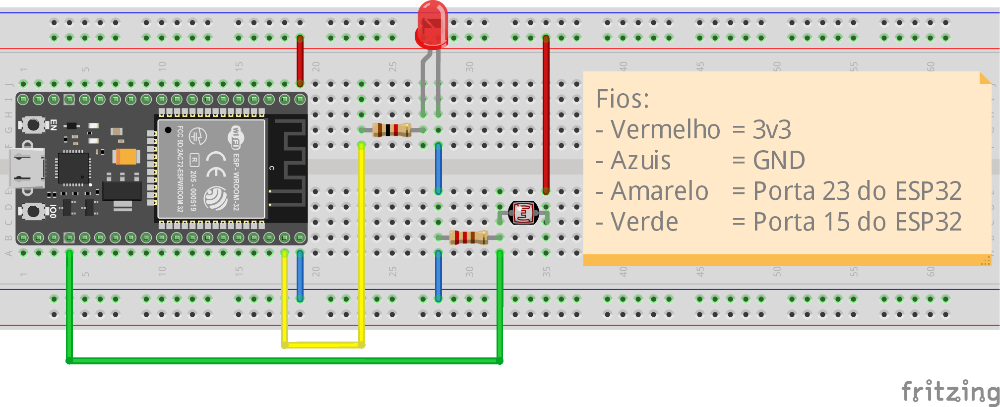

O circuito que montamos serve como um exemplo básico, mas bastante versátil. Utilizamos o LDR (*Light Dependent Resistor*) para representar o uso de uma grande gama de sensores analógicos, que funcionam de forma semelhante; na maioria dos casos, basta programar um conversor de unidades de medida para obter os valores desejados. O LED pode ser substituído por vários atuadores digitais, como relés, LEDs infravermelhos, controladores de motores, entre outros, todos controlados pelo mesmo tipo de sinal.

O que foi feito com um LDR e um LED aqui não difere muito de projetos mais complexos. O conhecimento adquirido com este exemplo pode ser facilmente aplicado em diversas outras situações, tornando-se uma base sólida para projetos futuros.

Neste circuito, utilizamos a GPIO 23 do ESP32 para controlar um LED. A conexão inclui um resistor de 1kΩ entre o terminal GPIO 23 e o anodo (+) do LED, com o cátodo (-) ligado ao GND. O resistor é necessário para limitar a corrente que passa pelo LED, evitando que ele seja danificado.

Além disso, ligamos um LDR à GPIO 15 para medir a luminosidade ambiente. O LDR e um resistor de 220Ω estão conectados em um divisor de tensão, onde o terminal do resistor vai ao GND e o terminal do LDR à tensão de 3.3V. A junção entre o LDR e o resistor é conectada à GPIO 15, formando um divisor de tensão que ajusta a tensão conforme a luminosidade detectada pelo LDR.