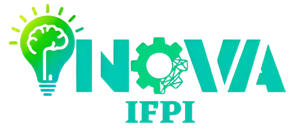

# **[INOVA IFPI 2014](https://www.inovaifpi.com/)**
## Minicurso: Introdução ao mundo da Internet das Coisas (IoT) 

Serão abordados os conceitos fundamentais de IoT, seguidos de uma parte prática que inclui a programação de dispositivos conectados. Os participantes aprenderão como configurar, programar e monitorar dispositivos IoT, além de explorar ferramentas de código aberto para o gerenciamento e visualização de dados em tempo real. O minicurso proporcionará uma compreensão básica de como funcionam os sistemas IoT.

**Conteúdo do curso**
 - Conceitos fundamentais de IoT e aplicações;
 - Programação de dispositivos conectados:
      - Configuração do ambiente de desenvolvimento;
      - Programação C/C++;
      - Monitorar dispositivos (comunicação serial);
      - Conexão à rede;
      - Configuração de container docker;
      - Comunicação IoT em rede local com protocolo MQTT;
 - Ferramentas de código aberto:
      - Arduino IDE;
      - Bibliotecas;
      - [ThingsBoard](https://thingsboard.io/);

*Objetivo:*
 - Compreensão básica de como funcionam os sistemas IoT.

---
[Correção para driver do NodeMCU ESP8266 v0.1](https://github.com/SHWotever/FakeCH340DriverFixer)

---
Prof. Me. Ronaldo Borges
IFPI - Campus Floriano